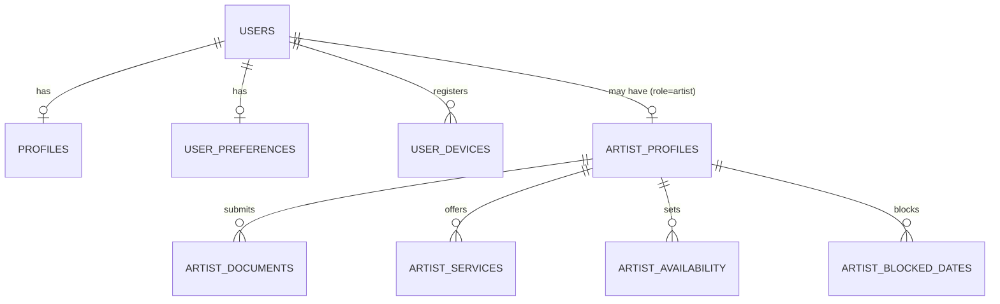
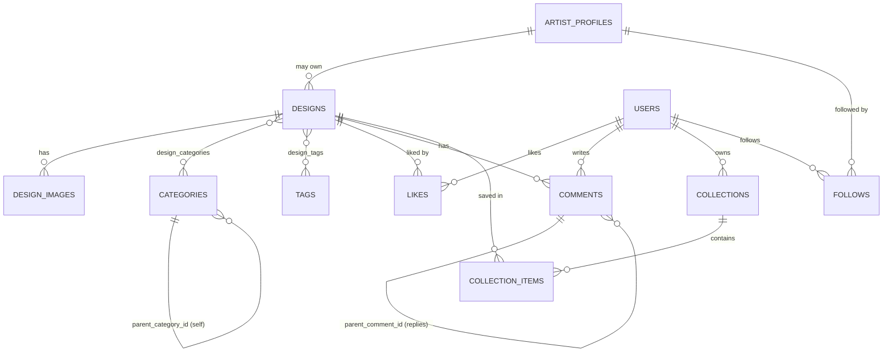
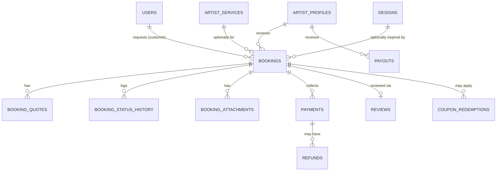
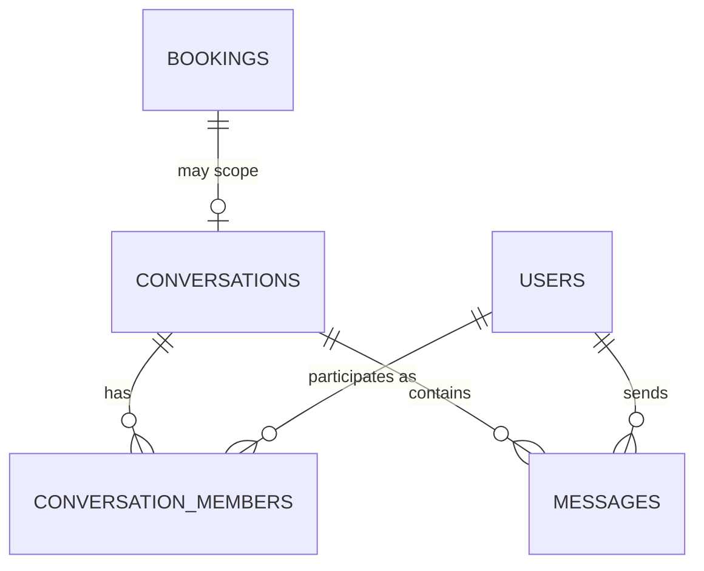
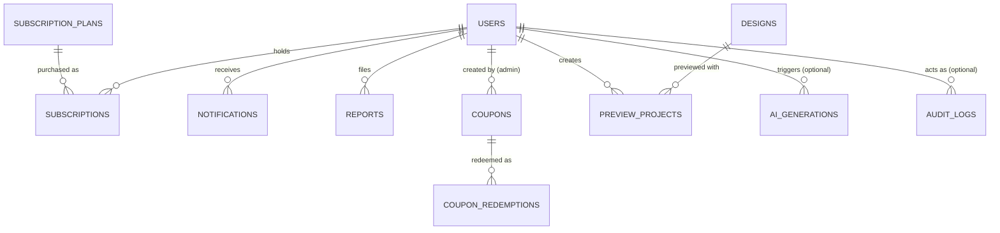

# MehndiVerse — Database Relationships

Status: Draft (Phase 2)
Last updated: 2026-07-14

This document describes how the 41 tables in the MehndiVerse schema relate to each other, grouped by domain. Column-level conventions (enum strategy, soft delete, cascades, money) are in [database-schema.md](database-schema.md). Booking status transitions are in [booking-status-rules.md](booking-status-rules.md).

## 1. Users & artists

* A `user` is the base account row (all roles). `role` (Guest excluded — guests have no row) is enum-constrained: `customer`, `artist`, `moderator`, `administrator`, `super_administrator`. Premium Customer and Verified Artist are **statuses**, not roles — see [user-roles-and-permissions.md](user-roles-and-permissions.md) and §3 below.
* `profiles` and `user_preferences` are 1:1 extensions of `users`, split out to keep auth-critical fields (`users`) separate from public-facing/preference fields. Both cascade-delete with their user.
* `user_devices` is 1:N (a user can register multiple push-notification devices); each `device_token` is globally unique.
* `artist_profiles` is a 1:1 extension of `users` for artist-role accounts. `verification_status` (`pending` → `under_review` → `verified`/`rejected`, or `suspended`) is how "Verified Artist" is represented — there is no separate role value for it.
* `artist_documents`, `artist_services`, `artist_availability`, `artist_blocked_dates` all belong to exactly one `artist_profile` (1:N).

## 2. Design catalog & engagement

* `designs.artist_profile_id` is **nullable** — a NULL means a platform/admin-curated design not tied to a specific artist's portfolio.
* `design_categories` and `design_tags` are pure many-to-many join tables with a composite primary key (no synthetic UUID) plus a `created_at` for "when was this tag/category applied."
* `categories.parent_category_id` self-references for a subcategory hierarchy (e.g. "Bridal" → "Bridal — Arabic Style"), nullable for top-level categories.
* `likes` and `follows` are pure join/fact tables (no soft delete — unliking or unfollowing is a real deletion). `collection_items` similarly.
* `comments` supports one level of nesting via `parent_comment_id`; it **is** soft-deleted so a removed parent comment doesn't orphan or corrupt a reply thread.

## 3. Bookings, quotes, and payments

* `bookings` is the center of the marketplace transaction. `status` follows the state machine in [booking-status-rules.md](booking-status-rules.md); the row is **never** deleted — cancellation is `status = 'cancelled'`, not a `DELETE`.
* `booking_quotes` is 1:N: a booking can accumulate multiple quotes over time (renegotiation). Only one should be `pending`/`accepted` at a time — that invariant is enforced at the application/service layer in a later phase, not by a DB constraint (documented, not yet code-enforced, per Phase 2 being schema-only).
* `booking_status_history` is an **append-only** audit log: one row per transition, `from_status` nullable for the initial `requested` row.
* `booking_attachments` holds photos/documents shared during a booking (reference images, ID proof for on-location bookings, etc.).
* `payments.booking_id` → `bookings`, `RESTRICT` on delete. A `payment` can have multiple `refunds` (partial refunds). `payouts.booking_id` is nullable because a payout may later aggregate multiple bookings (not modeled yet — out of scope per [feature-scope.md](feature-scope.md), payout automation is Post-MVP).
* `reviews.booking_id` is unique — exactly one review per booking.
* `coupon_redemptions.booking_id` is nullable (a coupon could in principle be redeemed outside a booking context, e.g. a subscription discount — not modeled yet, column exists for the booking case which is the only one wired up now).

## 4. Messaging

* `conversations.booking_id` is nullable — `type` distinguishes `booking` (scoped to a specific booking), `inquiry` (pre-booking question), and `support` (customer/artist ↔ staff).
* `conversation_members` is the join between `conversations` and `users`, carrying a per-conversation `role` label and read-state (`last_read_at`).
* `messages.sender_id` uses `RESTRICT` (a message shouldn't be able to lose its author via cascade); `conversation_id` uses `CASCADE` (deleting a conversation removes its messages — conversations themselves are not currently deletable from the UI, this is a safety net for admin cleanup).

## 5. Subscriptions, reviews, notifications, moderation, coupons, AI, system

* `subscription_plans.target_role` distinguishes Customer (Premium Customer) plans from Artist (visibility-boost) plans, per [feature-scope.md](feature-scope.md#2-post-mvp) — both share one table since the shape (price, billing interval, feature flags) is identical.
* `reports.reported_entity_id` is a **polymorphic reference with no database foreign key** — see [database-schema.md](database-schema.md#8-polymorphic-references). `reported_entity_type` says which table `reported_entity_id` points into (`design`, `comment`, `message`, `user`, `artist_profile`, `review`); the application validates the reference exists at write time.
* `ai_generations.user_id` is nullable to allow logging guest AI usage (rate-limited discovery/preview per [user-roles-and-permissions.md](user-roles-and-permissions.md)) via `guest_session_id` instead.
* `audit_logs.actor_id` is nullable for system-initiated actions (e.g. an automated booking expiry) and `SET NULL` on user deletion — see [database-schema.md](database-schema.md#6-foreign-keys-and-cascade-policy).
* `system_settings` is a flat key/value (JSONB value) store for non-critical runtime configuration, editable by Administrators (`is_public` marks whether a setting is safe to expose to clients).

## 6. Related documents

* [database-schema.md](database-schema.md)
* [booking-status-rules.md](booking-status-rules.md)
* [migration-guidelines.md](migration-guidelines.md)
* [system-architecture.md](system-architecture.md)
