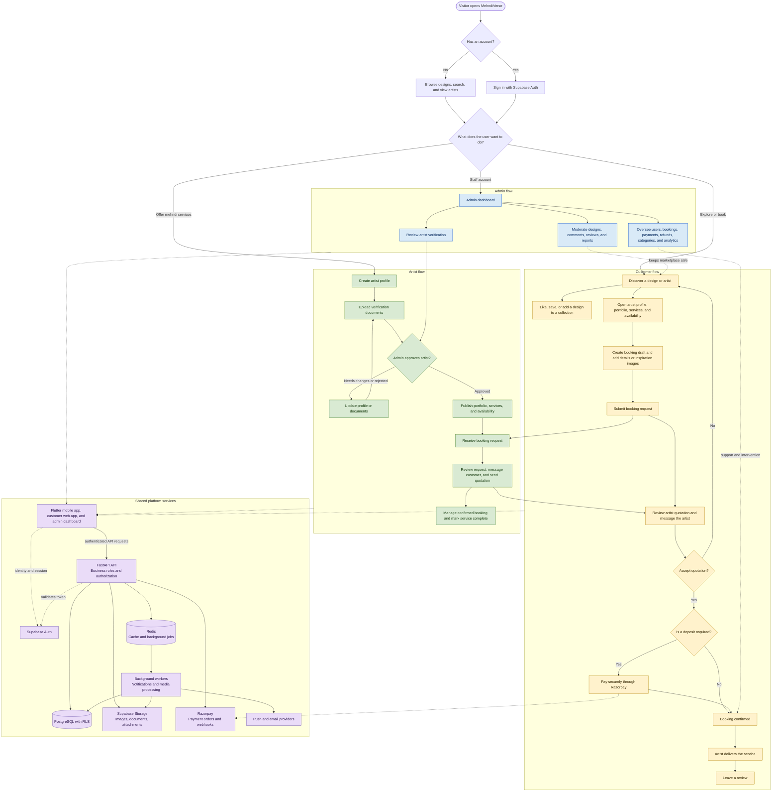

# MehndiVerse Project Flow Diagram

This is the quickest way to understand what MehndiVerse does and how its parts
work together. It reflects the implemented platform flow: customers discover
designs and book artists; artists manage their services and requests; admins
keep the marketplace safe and operational.

Open this file in GitHub, VS Code with a Mermaid preview extension, or any
Mermaid-compatible Markdown viewer to see the rendered diagram.

## How to read it

- Solid arrows are normal user or system actions.
- Dashed arrows show a supporting connection, rather than the main journey.
- Yellow is the customer journey, green is the artist journey, blue is the
  admin journey, and purple is shared technical infrastructure.
- A booking connects the customer and artist journeys. Payment confirmation is
  controlled by the backend using Razorpay webhooks, rather than trusting a
  browser or mobile-app success message.

## Important booking outcomes

The main happy path above is intentionally simple. A booking can also be
cancelled or rejected, rescheduled, disputed, or (after completion) enter a
refund process. For the complete status-by-status state machine, see
[booking-lifecycle.md](booking-lifecycle.md).

## Related documentation

- [System architecture](system-architecture.md)
- [Product requirements](product-requirements.md)
- [Roles and permissions](user-roles-and-permissions.md)
- [Payment flow](payments.md)
