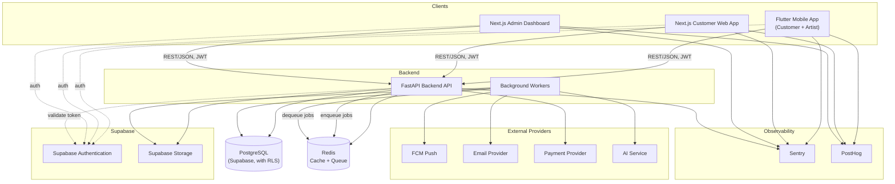
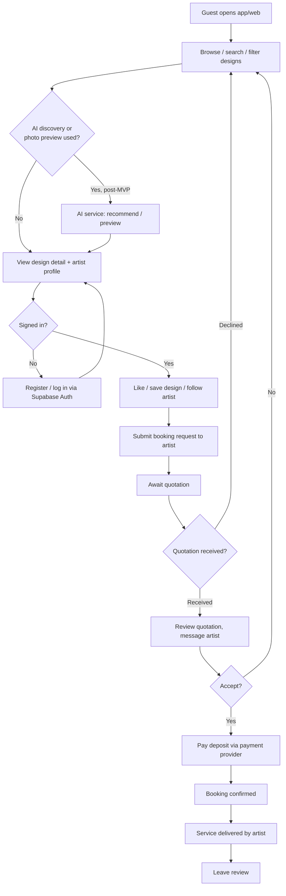
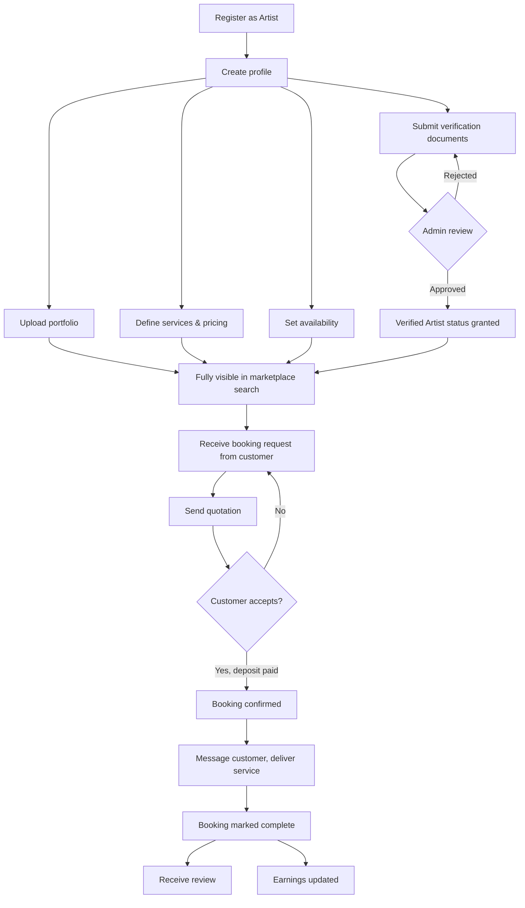
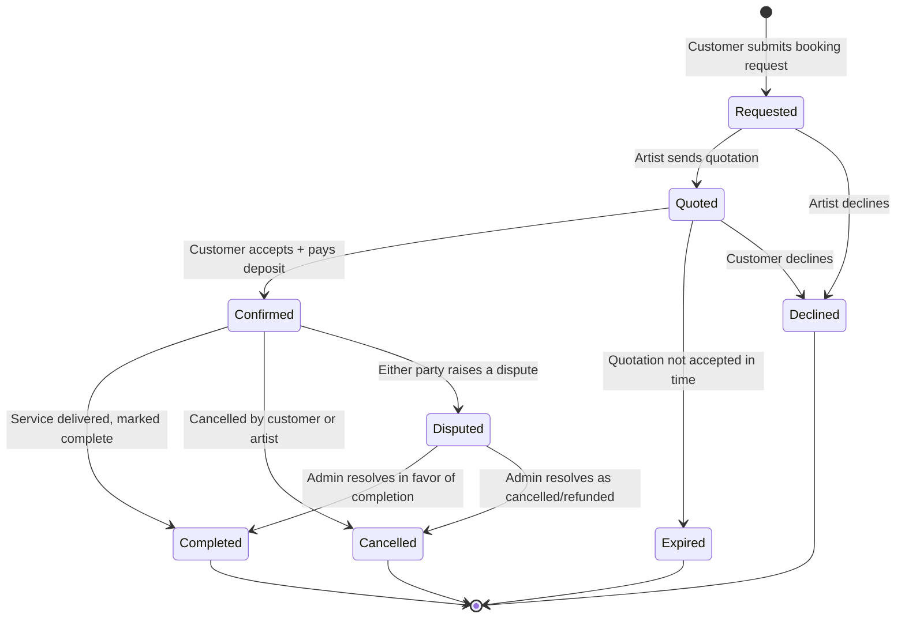
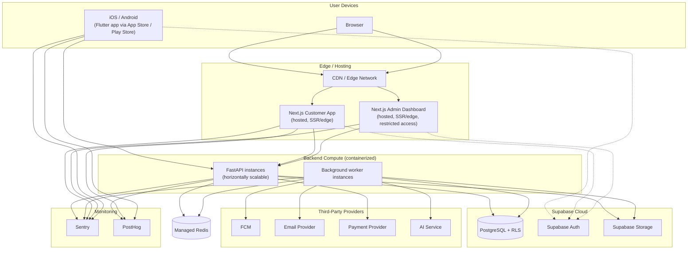

# MehndiVerse — System Architecture

Status: Draft (Phase 0)
Last updated: 2026-07-14

This document describes the target architecture for MehndiVerse at a component level. No code exists yet — this is the plan that later phases implement against. Nothing here should contradict [product-requirements.md](product-requirements.md) or [decisions/0001-technology-stack.md](decisions/0001-technology-stack.md).

## 1. Components

| Component | Technology | Responsibility |
|---|---|---|
| Mobile app | Flutter, Dart, Riverpod, GoRouter, Dio, Freezed, FCM | Customer and artist experience on iOS/Android. |
| Customer web app | Next.js, TypeScript, App Router, Tailwind CSS, TanStack Query, React Hook Form, Zod | Customer and artist experience on the web. |
| Admin dashboard | Next.js, TypeScript, App Router, Tailwind CSS, TanStack Query, React Hook Form, Zod | Moderator/Administrator/Super Administrator tooling. Separate app from the customer web app — different auth posture and audience. |
| Backend API | FastAPI, Python, Pydantic, SQLAlchemy, Alembic | Single source of business logic and authorization for all clients. Owns the domain: users, designs, artists, bookings, quotations, payments, messaging, reviews, admin operations. |
| Database | PostgreSQL (via Supabase) | System of record. Row-Level Security policies provide a data-layer authorization backstop. |
| Cache & queue | Redis | Read-through caching for hot catalog/search data; broker for background job queue. |
| Background workers | Python (worker processes consuming the Redis-backed queue) | Async work off the request path: notification fan-out, image/thumbnail processing, AI inference calls, scheduled/report jobs. |
| Object storage | Supabase Storage | Design images, portfolio media, verification documents, chat attachments. |
| Auth | Supabase Authentication | Identity, session/JWT issuance for all three clients. |
| Notification providers | FCM (push), transactional email provider | Booking/message/verification event delivery. |
| Payment provider | Abstracted behind an internal interface (concrete provider TBD per [product-requirements.md](product-requirements.md#7-open-questions--decisions-deferred)) | Deposit collection, refund initiation. |
| AI service | Abstracted behind an internal interface (concrete provider TBD) | Design discovery (search/recommendation) and hand/foot photo preview. Post-MVP per [feature-scope.md](feature-scope.md). |
| Observability | Sentry (errors), PostHog (product analytics) | Cross-cutting, wired into all clients and the backend from MVP. |

## 2. Architectural principles

* **One backend, three clients.** All business logic and authorization live in FastAPI. Flutter, the customer Next.js app, and the admin Next.js app are presentation layers that call the same API surface (admin-only endpoints are a distinct, separately authorized route group, not a separate service, at MVP).
* **Supabase Auth issues identity; FastAPI enforces authorization.** Clients authenticate against Supabase and attach the resulting token to API calls; the backend independently validates role/ownership on every request per [user-roles-and-permissions.md](user-roles-and-permissions.md) — client-side role checks are UX only, never the security boundary.
* **RLS is a second, independent layer**, not a replacement for backend checks — defense in depth for the case where Supabase-mediated access (e.g., direct storage access) bypasses the API.
* **Non-interactive work is asynchronous.** Anything that doesn't need to block a client response (notification delivery, image processing, AI calls) goes through Redis to a background worker.
* **External providers are abstracted.** Payment and AI providers sit behind internal interfaces so a provider swap is a config/adapter change, not a rewrite of business logic.

## 3. System architecture diagram

## 4. Customer journey

## 5. Artist journey

## 6. Booking lifecycle

## 7. Deployment architecture

## 8. Data ownership boundaries

* **PostgreSQL (Supabase)** is the single system of record for users, designs, artist profiles, bookings, quotations, reviews, and messaging metadata.
* **Redis** holds no data that cannot be reconstructed from PostgreSQL — it is cache and queue only, never a durability boundary.
* **Supabase Storage** holds binary media (images, documents, attachments); PostgreSQL stores references (URLs/keys), not blobs.
* **Payment provider** is the system of record for raw payment instrument data; MehndiVerse stores only provider-issued references (charge IDs, status), never raw card data — see [security-baseline.md](security-baseline.md).

## 9. Related documents

* [product-requirements.md](product-requirements.md)
* [user-roles-and-permissions.md](user-roles-and-permissions.md)
* [feature-scope.md](feature-scope.md)
* [security-baseline.md](security-baseline.md)
* [decisions/0001-technology-stack.md](decisions/0001-technology-stack.md)
