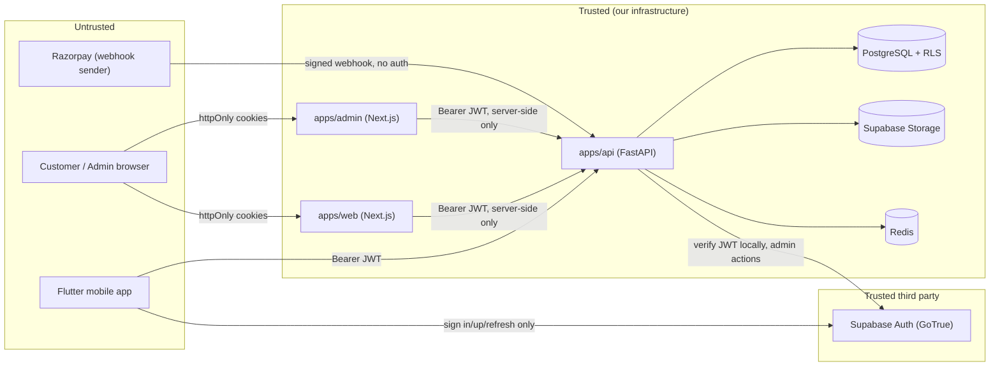

# MehndiVerse — Threat Model

Companion to [docs/security-review.md](security-review.md); that document is the audit-and-fix log, this one is the standing model of what MehndiVerse defends against and why. Update this file when a new asset, actor, or trust boundary is introduced — not just during a security-focused phase.

## 1. System overview and trust boundaries

**Trust boundary 1** — browser/mobile to `apps/web`/`apps/admin`/`apps/api`: everything crossing this boundary is attacker-controlled input.
**Trust boundary 2** — `apps/web`/`apps/admin` to `apps/api`: these two Next.js apps are the *only* holders of a user's access token (in an httpOnly cookie); they proxy to the API server-side. A compromised browser (XSS) cannot read the token directly, only ride along on requests the app itself makes.
**Trust boundary 3** — `apps/api` to PostgreSQL: the app's own DB role bypasses RLS (it's the schema owner); RLS is a second boundary for any *other* path into the same database (a future direct Supabase client, or PostgREST).
**Trust boundary 4** — Razorpay to `apps/api`: the payment-webhook endpoint has no session/user context at all — authenticity comes entirely from HMAC signature verification.

## 2. Assets

| Asset | Where | Sensitivity |
|---|---|---|
| User credentials | Supabase Auth (never our DB — no password hash stored locally) | Critical |
| Access/refresh tokens | httpOnly cookies (web/admin), device storage (mobile) | Critical |
| Payment references (no card data) | `payments` table | High |
| Verification documents (ID scans) | `verification-documents` bucket (private) | High |
| Hand/foot preview photos | `preview-projects` bucket (private) | High |
| Chat messages/attachments | `messages`, `chat-attachments` bucket | High |
| Profile PII (name, city, bio) | `profiles` table | Medium |
| Design catalog / portfolio images | `portfolio`/`avatars` buckets (public by design) | Low |
| Audit log | `audit_logs` table | High (integrity, not confidentiality — staff-readable by design) |
| Supabase service-role key, Razorpay secret, AI provider key | `apps/api/.env`, never committed | Critical |

## 3. Actors

- **Anonymous visitor** — browses public catalog/artist pages, no session.
- **Customer** — authenticated, books artists, messages, pays, requests AI generations.
- **Artist** — authenticated, manages portfolio/availability/bookings, receives payments.
- **Moderator** — staff, reviews reports/verification queues, no financial/role-change power.
- **Administrator / Super Administrator** — staff, full RBAC power including role changes and refunds.
- **Payment provider (Razorpay)** — external system, only ever reaches the webhook endpoint.
- **External attacker** — the threats below are framed from this actor's perspective unless noted.

## 4. Threats and mitigations (STRIDE)

### Spoofing

| Threat | Mitigation |
|---|---|
| Forged access token | Local JWT signature verification (`app/core/security.py`), HS256 against the Supabase project secret |
| Session fixation / hijacked cookie | `httpOnly` + `SameSite=Lax` + `Secure` (prod) cookies; XSS can't read the token directly |
| Forged payment webhook | Constant-time HMAC verification (`razorpay_provider.py::verify_webhook_signature`) before any parsing |
| Credential stuffing against one account | Account-keyed login lockout (`app/services/login_security.py`) on top of IP rate limiting |
| Impersonating another user via a stolen-but-valid token to perform a destructive action | Reauthentication (password re-verification) required for account deletion and session revocation |

### Tampering

| Threat | Mitigation |
|---|---|
| Client sends a role field to self-elevate | Registration always creates `customer`; role changes only via `require_roles("admin","super_admin")`-gated endpoint; DB trigger `app_prevent_role_self_escalation` blocks it even via direct Postgres-role access |
| Modified webhook payload | HMAC verification is over the *raw* request body, checked before JSON parsing |
| Malicious/oversized/format-spoofed file upload | Pillow decode-validate (ignores claimed `Content-Type`), size caps, pixel-count cap, PDF magic-byte check |
| SQL injection | SQLAlchemy parameterization everywhere; no raw string-interpolated SQL found in review |
| Cross-site request forgery on a mutating endpoint | `SameSite=Lax` cookies + explicit `Origin`/`Referer` check in `apps/web`/`apps/admin` middleware |

### Repudiation

| Threat | Mitigation |
|---|---|
| Staff member denies performing a privileged action | `AuditLog` (actor, ip, user-agent, before/after state) on every role change, moderation action, refund, and (this phase) login-lockout/session-revoke/account-deletion event |
| User claims they didn't request account deletion | Reauthentication required to request it; audit-logged with ip/user-agent |

### Information Disclosure

| Threat | Mitigation |
|---|---|
| Verification document / preview photo URL leaked | Private buckets, no durable public URL — only short-lived signed URLs minted server-side per authorized request |
| Stack trace / internal error detail in an API response | Generic fixed messages for validation/unhandled-exception responses; detail only in server-side logs |
| Secret value in logs | structlog redaction processor (`_redact_sensitive_fields`) |
| Enumerating registered emails via login/password-reset responses | Both return an identical generic message regardless of whether the email exists |
| Cross-tenant data read via a defect in the API's own authorization logic | RLS as an independent second layer for any Supabase-mediated path |
| Dependency with a known CVE | `pip-audit`/`npm audit` in CI, Dependabot |

### Denial of Service

| Threat | Mitigation |
|---|---|
| Login brute-force flooding | IP rate limit (`auth_rate_limit`) + account lockout |
| Expensive/degenerate full-text search query | `search_sanitize.py` (length cap, control-char strip) + `search_rate_limit` |
| Decompression-bomb image upload | Pillow pixel-count cap ahead of any resize/re-encode work |
| General API abuse | Per-feature `slowapi` rate limits (`app/core/config.py`) |

*Out of scope*: distributed/volumetric DoS is a hosting-platform/CDN concern, not addressed at the application layer.

### Elevation of Privilege

| Threat | Mitigation |
|---|---|
| Customer calls a staff-only endpoint | `require_roles()` on every admin route, enforced server-side |
| Moderator performs an admin-only action (role change, refund) | Endpoint-specific role checks beyond the base RBAC gate |
| A revoked/deleted account's token still works | `get_current_user` rejects any account with `deleted_at` set; `deleted_at` is now actually written by `process_account_deletions` (previously dangling — see security-review.md#account-deletion) |

## 5. Accepted risks / deferred

- **No Supabase Admin API integration for hard-deleting `auth.users`** — deletion finalization anonymizes our own data but leaves the Supabase Auth record technically present (unusable against our API regardless). Recommended follow-up phase.
- **CSP allows `'unsafe-inline'` for styles** (apps/web, apps/admin) — Next.js's own injected styles need it; no nonce wiring exists yet.
- **RLS not yet extended to every table** (`likes`, `follows`, `collection_items`, `comments`, notification/settings tables) — lower sensitivity, deferred to a smaller follow-up.
- **Volumetric/network-layer DoS** — hosting-platform responsibility, not this codebase's.
- **Distributed credential stuffing across many different target accounts simultaneously** — per-account lockout doesn't stop an attacker trying one guess against thousands of accounts; would need device-fingerprinting/CAPTCHA, deferred as a product decision.

## Related documents

- [docs/security-review.md](security-review.md)
- [docs/incident-response.md](incident-response.md)
- [docs/security-baseline.md](security-baseline.md)
