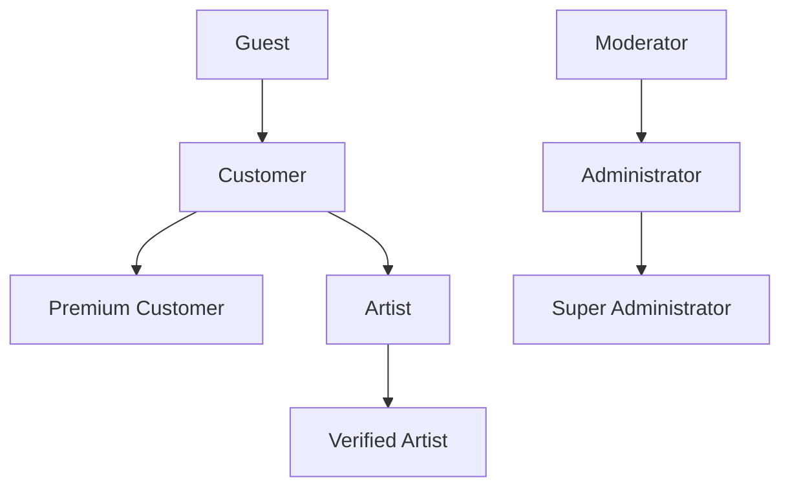

# MehndiVerse — User Roles and Permissions

Status: Draft (Phase 0)
Last updated: 2026-07-14

This document defines the eight roles in MehndiVerse and their permissions. Authorization must be enforced server-side (FastAPI + PostgreSQL Row-Level Security), never solely in Flutter/Next.js clients — see [security-baseline.md](security-baseline.md).

## 1. Role hierarchy

Notes:
* Customer and Artist are distinct account tracks from the same base authenticated user; a person could in principle hold both, but MVP treats each account as single-track (customer OR artist) unless a later phase decides otherwise.
* Premium Customer and Verified Artist are status upgrades on top of Customer/Artist, not separate signup paths.
* Moderator, Administrator, and Super Administrator are internal staff roles, not self-service signups.

## 2. Role definitions

### 2.1 Guest
Unauthenticated visitor. No account required.

### 2.2 Customer
Authenticated end-user seeking mehndi services. Default role after signup for non-artist accounts.

### 2.3 Premium Customer
A Customer with an active paid subscription. Superset of Customer permissions plus enhanced discovery/booking features (post-MVP).

### 2.4 Artist
Authenticated user who has registered as a service provider but has not yet passed verification. Limited marketplace visibility until verified.

### 2.5 Verified Artist
An Artist whose verification documents have been reviewed and approved by an Administrator. Full marketplace visibility and ability to receive bookings and payments.

### 2.6 Moderator
Internal staff role focused on content moderation and dispute triage. Cannot manage payments, subscriptions, or system configuration.

### 2.7 Administrator
Internal staff role with broad operational control: users, artist verification, catalog, bookings, payments/refunds, subscriptions, analytics.

### 2.8 Super Administrator
Highest-privilege internal role. Everything an Administrator can do, plus managing other Administrators/Moderators and system-level configuration.

## 3. Permission matrix

Legend: ✅ full access · ➕ limited/own-resource access · ❌ no access

| Capability | Guest | Customer | Premium Customer | Artist | Verified Artist | Moderator | Administrator | Super Admin |
|---|---|---|---|---|---|---|---|---|
| Browse public designs | ✅ | ✅ | ✅ | ✅ | ✅ | ✅ | ✅ | ✅ |
| Search & filter designs | ✅ | ✅ | ✅ | ✅ | ✅ | ✅ | ✅ | ✅ |
| AI design discovery | ➕ (rate-limited) | ✅ | ✅ (higher limits) | ✅ | ✅ | ✅ | ✅ | ✅ |
| AI hand/foot photo preview | ➕ (rate-limited) | ✅ | ✅ (higher limits) | ✅ | ✅ | ✅ | ✅ | ✅ |
| Like / save designs | ❌ | ✅ | ✅ | ✅ | ✅ | ✅ | ✅ | ✅ |
| Create collections | ❌ | ➕ (capped count) | ✅ (unlimited) | ➕ | ➕ | ❌ | ❌ | ❌ |
| Follow artists | ❌ | ✅ | ✅ | ✅ | ✅ | ❌ | ❌ | ❌ |
| View artist portfolios | ✅ | ✅ | ✅ | ✅ | ✅ | ✅ | ✅ | ✅ |
| Request bookings | ❌ | ✅ | ✅ (priority) | ❌ | ❌ | ❌ | ❌ | ❌ |
| Receive booking requests | ❌ | ❌ | ❌ | ➕ (visibility-limited) | ✅ | ❌ | ❌ | ❌ |
| Send quotations | ❌ | ❌ | ❌ | ➕ | ✅ | ❌ | ❌ | ❌ |
| Pay booking deposit | ❌ | ✅ | ✅ | ❌ | ❌ | ❌ | ❌ | ❌ |
| In-app messaging | ❌ | ✅ | ✅ | ✅ | ✅ | ➕ (read for disputes) | ➕ (read for disputes) | ➕ |
| Leave reviews | ❌ | ➕ (own completed bookings) | ➕ | ❌ | ❌ | ❌ | ➕ (moderate) | ➕ |
| Create/edit own artist profile | ❌ | ❌ | ❌ | ✅ | ✅ | ❌ | ➕ (on behalf, support) | ➕ |
| Submit verification documents | ❌ | ❌ | ❌ | ✅ | ✅ (re-verification) | ❌ | ❌ | ❌ |
| Review/approve artist verification | ❌ | ❌ | ❌ | ❌ | ❌ | ➕ (flag only) | ✅ | ✅ |
| Manage services & pricing | ❌ | ❌ | ❌ | ✅ | ✅ | ❌ | ❌ | ❌ |
| Set availability | ❌ | ❌ | ❌ | ✅ | ✅ | ❌ | ❌ | ❌ |
| Track own earnings/reviews | ❌ | ❌ | ❌ | ✅ | ✅ | ❌ | ❌ | ❌ |
| Manage user accounts | ❌ | ❌ | ❌ | ❌ | ❌ | ❌ | ✅ | ✅ |
| Moderate designs/portfolios | ❌ | ❌ | ❌ | ❌ | ❌ | ✅ | ✅ | ✅ |
| Manage categories/taxonomy | ❌ | ❌ | ❌ | ❌ | ❌ | ❌ | ✅ | ✅ |
| Manage bookings (oversight) | ❌ | ❌ | ❌ | ❌ | ❌ | ➕ (view) | ✅ | ✅ |
| Review payments & refunds | ❌ | ❌ | ❌ | ❌ | ❌ | ❌ | ✅ | ✅ |
| Handle reports & disputes | ❌ | ➕ (file own) | ➕ | ➕ (file own) | ➕ | ✅ | ✅ | ✅ |
| Manage subscriptions (plans) | ❌ | ❌ | ❌ | ❌ | ❌ | ❌ | ✅ | ✅ |
| View platform analytics | ❌ | ❌ | ❌ | ❌ | ❌ | ➕ (moderation stats only) | ✅ | ✅ |
| Manage system configuration | ❌ | ❌ | ❌ | ❌ | ❌ | ❌ | ➕ (non-critical config) | ✅ |
| Manage other admins/moderators | ❌ | ❌ | ❌ | ❌ | ❌ | ❌ | ❌ | ✅ |

## 4. Enforcement principles

* Every write operation is authorized against the caller's role and resource ownership server-side in FastAPI, independent of any client-side role checks in Flutter or Next.js.
* PostgreSQL Row-Level Security policies provide a second enforcement layer at the data level for Supabase-mediated access, so a bug in application-layer checks does not expose data directly.
* Role elevation (Customer → Artist, Artist → Verified Artist, staff role grants) is always performed through an explicit administrative action, never a self-service field update.
* Super Administrator actions that modify other staff accounts or system configuration are audit-logged.

## 5. Related documents

* [product-requirements.md](product-requirements.md)
* [feature-scope.md](feature-scope.md)
* [security-baseline.md](security-baseline.md)
